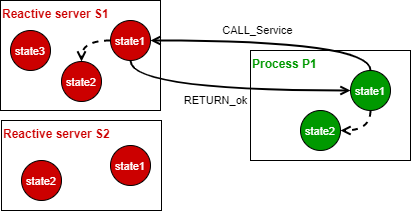
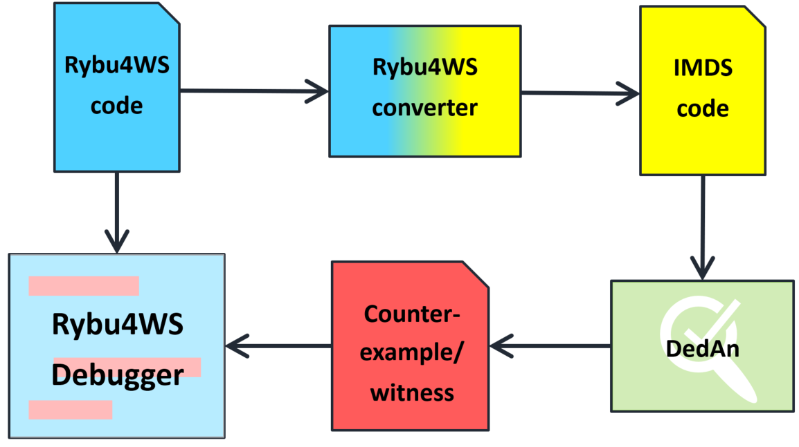
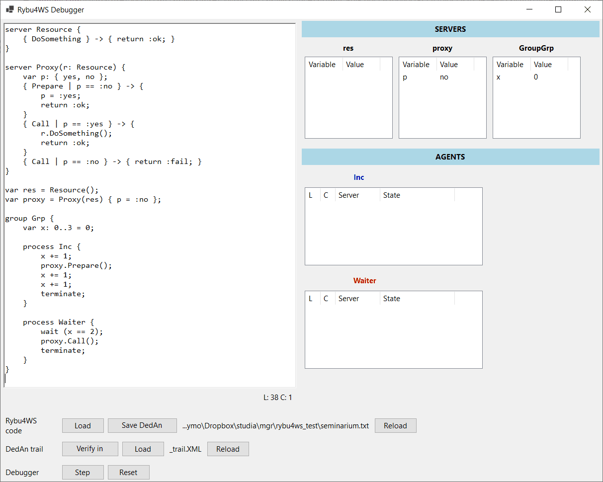

# Rybu4WS

This repository contains source of **Rybu4WS language parser** and **Rybu4WS Debugger** application.

Rybu4WS was designed as a part of my Master's thesis titled [**Specification and verification of Web Service composition in DedAn environment**](https://repo.pw.edu.pl/info/master/WUTfe509ac3967748c8b159e81620f9a93c/).

Additionaly, it it a subject of [**An Experimentation Framework for Specification and Verification of Web Services**](https://ieeexplore.ieee.org/document/9908728) article published in [*Proceedings of the 17th Conference on Computer Science and Intelligence Systems*](https://ieeexplore.ieee.org/xpl/conhome/9908518/proceeding).  
---> PDF available [**here**](https://annals-csis.org/Volume_30/pliks/fedcsis.pdf), page 913.

Rybu4WS uses [ANTLR4](https://www.antlr.org/) for grammar description and parser generation.  
Application was implemented in C# language.  
[DedAn](http://staff.ii.pw.edu.pl/dedan/) tool is required for verification against deadlocks or finding terminations.

## What is Rybu4WS?

The Rybu4WS language was developed for modeling Web Service compositions, overcoming the limitations imposed by [Rybu](https://github.com/zyla/rybu). Rybu4WS is based on the original Rybu language **but is not backward compatible** and features more advanced functionality which is necessary for Web Service composition, for example:
- server-server communication that allows agents to travel between different
servers and execute complex scenarios,
- state variables in grouped processes, which enables the communication between
different processes without sending actual IMDS messages,
- termination at any point of execution,
- complex code sequences in reactive server actions instead of trivial state mutation
and return value.

Like Rybu, the Rybu4WS system consists of reactive servers and processes (in Rybu: *thread*).
The reactive server is a resource that holds a particular state and offers services.
Each service can be guarded by a condition over variables and contains a code sequence for further actions.
The reactive server is converted to an IMDS server and does not serve as an entry point for the agent, but only reacts for the external invocations by executing specified services.
The process, when converted to IMDS, instantiates an agent and is used as the agent’s entry point.
It consists of a code sequence that the agent executes to invoke services on reactive servers.
Variables cannot be declared inside the process, meaning that the IMDS server representing the process does not hold any state (except states used to simulate
program counter).

The following image illustrates service invocation on the reactive server by the process. Rectangles represent IMDS servers, circles represent IMDS states, arrows (between servers) represent IMDS messages and dotted arrows (inside servers) are the result of IMDS action pair (*CALL_Service*, *RETURN_ok*) invocation - proceeding to the next IMDS state in the server.  


Rybu4WS introduces a third, more advanced feature called group, which is used to group one or more processes.
It gives the possibility to declare shared variables, allowing the creation of more sophisticated scenarios where processes use the same variables within a server to cooperate.

Rybu4WS language is used only for modeling distributed systems and cannot be directly verified against deadlocks or terminations.
For the purpose of verification in the [DedAn](http://staff.ii.pw.edu.pl/dedan/) environment, Rybu4WS code must be converted into IMDS equivalent using a set of unambiguous translation rules.

**More in-depth explanation of Rybu4WS can be found in my Master's thesis [Specification and verification of Web Service composition in DedAn environment](https://repo.pw.edu.pl/info/master/WUTfe509ac3967748c8b159e81620f9a93c/).**

## Rybu4WS Debugger

Rybu4WS Debugger is a desktop app that allows to load Rybu4WS code and convert it into corresponding IMDS representation for the purpose of verification in the DedAn
environment.
After verification, DedAn may present a counterexample/witness, which can be visualized in a user-friendly way for the manual analysis.




## Example Rybu4WS source code
```
type BOOL = { t, f };

server Payment {
    var s: { none, pending, paid };
    { Init | s == :none } -> { return :ok; }
    { Confirm | s == :pending } -> { s = :paid; return :ok; }
    { IsPaid | s == :paid } -> { return :t; }
}

server Bank(p: Payment) {
    var bal: 0..5;
    var s: BOOL;
    { Transfer | bal > 0 && s == :f } -> {
        s = :t;
        return :confReq;
    }
    { Transfer | bal == 0 || s == :t } -> {
        return :fail;
    }
    { Confirm | s == :t && bal > 0 } -> {
        bal -= 1;
        s = :f;
        p.Confirm();
        return :ok;
    }
}

server Warehouse() {
    var x: BOOL;
    { Reserve | x == :f } -> { x = :t; return :ok; }
    { Reserve | x == :f } -> { return :outOfStock; }
    { Dispatch | x == :t } -> { x = :f; return :ok; }
}

server BookShop(w: Warehouse, p: Payment) {
    { Begin } -> {
        match w.Reserve() {
            :outOfStock -> { return :fail; }
            :ok -> { p.Init(); return :payReq; }
        }
    }
    { End } -> {
        match p.IsPaid() {
            :t -> { w.Dispatch(); return :ok; }
        }
    }
}

var p = Payment() { s = :none };
var b = Bank(p) { bal = 3, s = :f };
var w = Warehouse() { x = :f };
var bs = BookShop(w, p);

group BookPurchaseScenario {
    var action: { idle, none, pay } = :idle;
    
    process UserWebInterface {
        match bs.Begin() {
            :fail -> { action = :none; terminate; }
            :payReq -> {
                match b.Transfer() {
                    :confReq -> {
                        action = :pay; bs.End(); terminate;
                    }
                    :fail -> { terminate; }
                }
            }
        }
    }

    process UserMobileApp {
        wait(action != :idle);
        if (action == :pay) { b.Confirm(); }
        terminate;
    }
}
```
